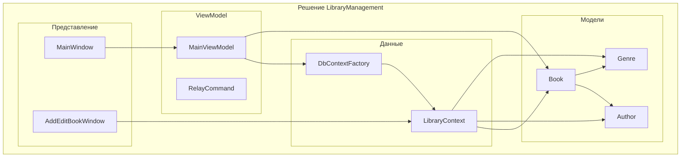
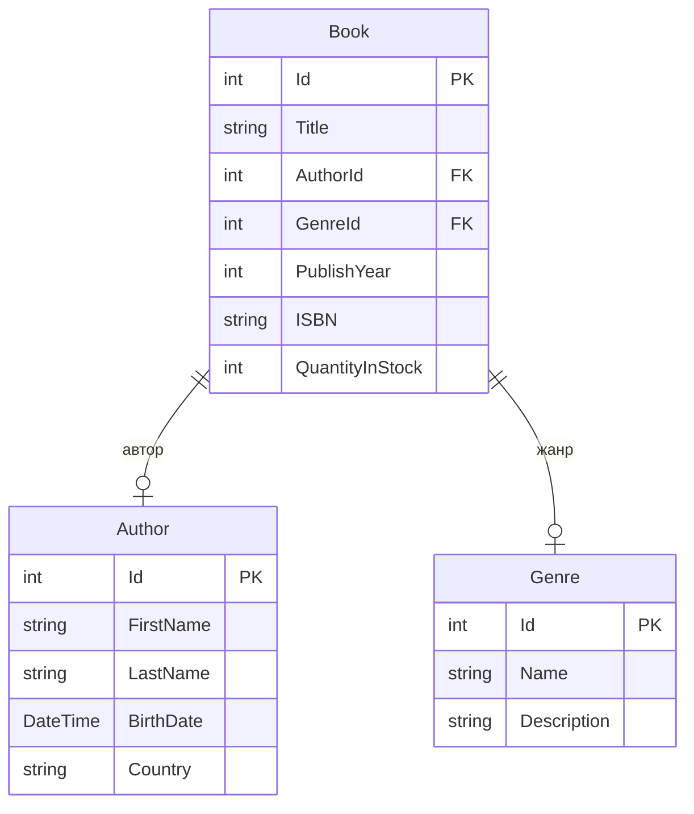
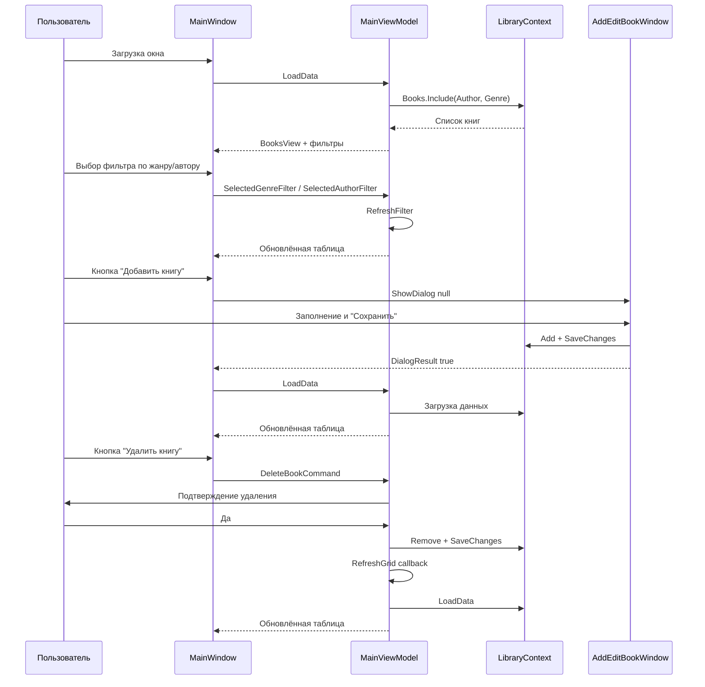

# Отчёт по проекту: приложение «Управление библиотекой»

**WPF-приложение для учёта книг на C# с Entity Framework Core и SQLite**

---

## Содержание

1. [Введение](#1-введение)
2. [Технологический стек](#2-технологический-стек)
3. [Архитектура решения](#3-архитектура-решения)
4. [Структура проекта](#4-структура-проекта)
5. [Модель данных и база данных](#5-модель-данных-и-база-данных)
6. [Пользовательский интерфейс](#6-пользовательский-интерфейс)
7. [Сборка и запуск](#7-сборка-и-запуск)
8. [Заключение](#8-заключение)

---

## 1. Введение

Проект представляет собой десктопное приложение для управления каталогом книг в библиотеке. Реализованы операции просмотра списка книг, фильтрации по жанру и автору, добавления, редактирования и удаления книг. Все данные хранятся в локальной базе SQLite и настраиваются через Entity Framework Core (Fluent API).

**Цели проекта:**

- Демонстрация связки **WPF + EF Core + SQLite** в одном решении.
- Использование паттерна **MVVM** для разделения логики и интерфейса.
- Настройка сущностей и связей только через **Fluent API** (первичные ключи, обязательные поля, ограничения длины, каскадное удаление).

**Основные возможности:**

- Просмотр таблицы книг с колонками: название, автор, жанр, год издания, ISBN, количество в наличии.
- Динамическая фильтрация по жанру и автору (таблица обновляется сразу при выборе значения).
- Добавление новой книги с выбором автора и жанра из справочников.
- Редактирование выбранной книги.
- Удаление выбранной книги с подтверждением.
- При первом запуске автоматическое создание базы и заполнение тестовыми данными.

---

## 2. Технологический стек

| Компонент | Технология |
|-----------|------------|
| Язык | C# |
| Платформа | .NET 8 |
| UI | WPF (Windows Presentation Foundation) |
| ORM | Entity Framework Core 8.0.11 |
| База данных | SQLite (Microsoft.EntityFrameworkCore.Sqlite) |
| Паттерн представления | MVVM (ViewModel, команды, привязки) |
| Сборка | MSBuild / .NET CLI |

---

## 3. Архитектура решения

### 3.1. Общая схема решения

Решение состоит из одного WPF-проекта. Слои (модели, данные, представление, ViewModel) выделены папками внутри проекта.



### 3.2. Модель данных (сущности и связи)

Книга связана с одним автором и одним жанром (связи «многие к одному»). При удалении автора или жанра удаление блокируется, если на них ссылается хотя бы одна книга (поведение **Restrict**).



### 3.3. Поток данных и взаимодействие слоёв

Загрузка и фильтрация книг выполняются во ViewModel; диалог добавления/редактирования открывается из кода представления, после сохранения вызывается обновление таблицы.



### 3.4. Схема фильтрации

Фильтр по жанру и автору реализован через `ICollectionView` и предикат: при смене выбранного значения вызывается `Refresh()`, и в таблице остаются только подходящие книги.

```mermaid
flowchart LR
    subgraph filters [Фильтры]
        GenreCombo[ComboBox "Жанр"]
        AuthorCombo[ComboBox "Автор"]
    end
    subgraph vm [MainViewModel]
        SelectedGenre[SelectedGenreFilter]
        SelectedAuthor[SelectedAuthorFilter]
        FilterPredicate[FilterBook]
        BooksView[BooksView]
    end
    subgraph source [Источник]
        AllBooks[Все книги из БД]
    end
    GenreCombo --> SelectedGenre
    AuthorCombo --> SelectedAuthor
    SelectedGenre --> FilterPredicate
    SelectedAuthor --> FilterPredicate
    AllBooks --> BooksView
    FilterPredicate --> BooksView
    BooksView --> DataGrid[DataGrid]
```

---

## 4. Структура проекта

Исходный код (без служебных папок `bin` и `obj`):

```
P_1/
├── LibraryManagement.slnx          # Файл решения
└── LibraryManagement/
    ├── App.xaml                    # Ресурсы приложения
    ├── App.xaml.cs                 # Точка входа, инициализация БД, начальные данные
    ├── MainWindow.xaml             # Главное окно: таблица, фильтры, кнопки
    ├── MainWindow.xaml.cs          # Обработчики загрузки, вызов диалога, обновление таблицы
    ├── AddEditBookWindow.xaml      # Окно добавления/редактирования книги
    ├── AddEditBookWindow.xaml.cs   # Валидация, сохранение в БД через DbContext
    ├── LibraryManagement.csproj     # Проект, ссылки на EF Core и SQLite
    ├── AssemblyInfo.cs             # Атрибуты сборки
    ├── Models/                     # Сущности предметной области
    │   ├── Author.cs
    │   ├── Genre.cs
    │   └── Book.cs
    ├── Data/                       # Доступ к данным
    │   ├── LibraryContext.cs       # DbContext, конфигурация Fluent API
    │   └── DbContextFactory.cs     # Создание контекста с подключением к SQLite
    ├── ViewModels/                 # Логика представления
    │   ├── MainViewModel.cs         # Список книг, фильтры, команды Add/Edit/Delete
    │   └── RelayCommand.cs         # Реализация ICommand для привязки
    └── Converters/                 # Конвертеры для привязки
        └── FilterDisplayConverter.cs   # Отображение "Все" / название жанра / ФИО автора
```

---

## 5. Модель данных и база данных

### 5.1. Сущности

| Сущность | Описание |
|----------|----------|
| **Book** | Книга: название, ссылка на автора и жанр, год издания, ISBN, количество в наличии. |
| **Author** | Автор: имя, фамилия, дата рождения, страна. Вычисляемое свойство `FullName` для отображения. |
| **Genre** | Жанр: название, описание. |

### 5.2. Ограничения (Fluent API)

- **Первичные ключи:** у всех сущностей `Id` задан как ключ через `HasKey(e => e.Id)`.
- **Обязательные поля:** `Book.Title`, `Author.FirstName`, `Author.LastName`, `Genre.Name` — через `IsRequired()`.
- **Максимальная длина строк:**
  - Книга: `Title` — 200, `ISBN` — 20.
  - Автор: `FirstName`, `LastName`, `Country` — 100.
  - Жанр: `Name` — 100, `Description` — 500.
- **Связи и каскадное удаление:**
  - Книга → Автор: многие к одному, `OnDelete(DeleteBehavior.Restrict)` — нельзя удалить автора, если есть книги.
  - Книга → Жанр: многие к одному, `OnDelete(DeleteBehavior.Restrict)` — нельзя удалить жанр, если есть книги.

### 5.3. База данных

- **Файл:** `library.db` (SQLite), создаётся в каталоге запуска приложения.
- **Инициализация:** при старте приложения вызывается `context.Database.EnsureCreated()`.
- **Начальные данные:** если таблица книг пуста, в БД добавляются тестовые авторы, жанры и две книги (например, «Pride and Prejudice», «1984»).

---

## 6. Пользовательский интерфейс

### 6.1. Главное окно

- **Заголовок:** «Управление библиотекой».
- **Панель фильтров:** два выпадающих списка — «Фильтр по жанру» и «Фильтр по автору». Первый элемент — «Все» (без фильтра). При смене выбора таблица обновляется сразу.
- **Кнопки:** «Добавить книгу», «Изменить книгу», «Удалить книгу». Редактирование и удаление работают с выбранной в таблице строкой.
- **Таблица (DataGrid):** колонки — Название, Автор (полное имя), Жанр, Год издания, ISBN, В наличии. Редактирование ячеек отключено; выбор — одна строка.

### 6.2. Окно добавления/редактирования книги

- Открывается по кнопке «Добавить книгу» (заголовок «Добавить книгу») или «Изменить книгу» (заголовок «Изменить книгу»).
- Поля: название, автор (ComboBox), жанр (ComboBox), год издания, ISBN, количество в наличии.
- Кнопки: «Сохранить» (валидация и запись в БД, закрытие с `DialogResult = true`) и «Отмена».
- Сообщения об ошибках валидации и сохранения выводятся на русском языке.

---

## 7. Сборка и запуск

### Требования

- .NET 8 SDK.
- ОС Windows (WPF).

### Команды

```bash
# В корне репозитория (папка с LibraryManagement.slnx)
cd P_1

# Восстановление пакетов
dotnet restore LibraryManagement/LibraryManagement.csproj

# Сборка
dotnet build LibraryManagement/LibraryManagement.csproj

# Запуск
dotnet run --project LibraryManagement/LibraryManagement.csproj
```

Либо открыть решение в Visual Studio / Rider и запустить проект **LibraryManagement** (F5).

После первого успешного запуска в каталоге с исполняемым файлом появится файл `library.db`.

---

## 8. Заключение

В проекте реализовано небольшое приложение для учёта книг в библиотеке с использованием стека **C#**, **WPF**, **Entity Framework Core** и **SQLite**. Архитектура разделена на модели, слой данных (DbContext + Fluent API), ViewModel и представление (окна и привязки). Фильтрация по жанру и автору выполняется без перезагрузки формы за счёт `ICollectionView` и предиката. Проект готов к сборке и запуску после клонирования и выполнения `dotnet restore` и `dotnet build`.
